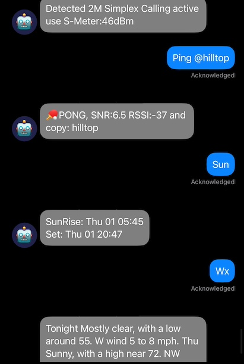

# Mesh Bot for Network Testing and BBS Activities

Welcome to the Mesh Bot project! This feature-rich bot is designed to enhance your [Meshtastic](https://meshtastic.org/docs/introduction/) network experience with a variety of powerful tools and fun features, connectivity and utility through text-based message delivery. Whether you're looking to perform network tests, send messages, or even play games, [mesh_bot.py](mesh_bot.py) has you covered. 



## Key Features

### Intelligent Keyword Responder
- **Automated Responses**: The bot detects keywords like "ping" and responds with "pong" in direct messages (DMs) or group channels.
- **Customizable Triggers**: Monitor group channels for specific keywords and set custom responses.
- **Emergency Response**: Monitor channels for keywords indicating emergencies and alert a wider audience.

### Network Tools
- **Build, Test Local Mesh**: Ping allow for message delivery testing with more realistic packets vs. telemetry
- **Test Node Hardware**: `test` will send incremental sized data into the radio buffer for overall length of message testing

### Dual Radio/Node Support
- **Simultaneous Monitoring**: Monitor two networks at the same time.
- **Flexible Messaging**: send mail and messages, between networks.

### Advanced Messaging Capabilities
- **Mail Messaging**: Leave messages for other devices, which are sent as DMs when the device is seen.
- **Scheduler**: Schedule messages like weather updates or reminders for weekly VHF nets.
- **Store and Forward**: Replay messages with the `messages` command, and log messages locally to disk.
- **Send Mail**: Send mail to nodes using `bbspost @nodeNumber #message` or `bbspost @nodeShortName #message`.
- **BBS Linking**: Combine multiple bots to expand BBS reach.
- **E-Mail/SMS**: Send mesh-messages to E-Mail or SMS expanding visability.

### Interactive AI and Data Lookup
- **NOAA location Data**: Get localized weather(alerts) and Tide information. Open-Meteo is used for wx only outside NOAA coverage. 
- **Wiki Integration**: Look up data using Wikipedia results.
- **Ollama LLM AI**: Interact with the [Ollama](https://github.com/ollama/ollama/tree/main/docs) LLM AI for advanced queries and responses.

### Proximity Alerts
- **Location-Based Alerts**: Get notified when members arrive back at a configured lat/long, perfect for remote locations like campsites.

### Fun and Games
- **Built-in Games**: Enjoy games like DopeWars, Lemonade Stand, BlackJack, and VideoPoker.
- **Command-Based Gameplay**: Issue `games` to display help and start playing.

### Radio Frequency Monitoring
- **SNR RF Activity Alerts**: Monitor a radio frequency and get alerts when high SNR RF activity is detected.
- **Hamlib Integration**: Use Hamlib (rigctld) to watch the S meter on a connected radio.

### NOAA EAS Alerts
- **EAS Alerts via NOAA API**: Use an internet-connected node to message Emergency Alerts from NOAA.
- **EAS Alerts over the air**: Utilizing external tools to report EAS alerts offline over mesh.

### File Monitor Alerts
- **File Monitor**: Monitor a flat/text file for changes, broadcast the contents of the message to the mesh channel.
- **News File**: On request of news, the contents of the file are returned.

### Data Reporting
- **HTML Generator**: Visualize bot traffic and data flows with a built-in HTML generator for [data reporting](logs/README.md).

### Robust Message Handling
- **Message Chunking**: Automatically chunk messages over 160 characters to ensure higher delivery success across hops.

## Getting Started
This project is developed on Linux (specifically a Raspberry Pi) but should work on any platform where the [Meshtastic protobuf API](https://meshtastic.org/docs/software/python/cli/) modules are supported, and with any compatible [Meshtastic](https://meshtastic.org/docs/getting-started/) hardware. For pico or low-powered devices, or [femtofox](https://github.com/noon92/femtofox) project for embedding, possibly see the [buildroot](https://github.com/buildroot-meshtastic/buildroot-meshtastic). 🥔 Please use responsibly and follow local rulings for such equipment. This project captures packets, logs them, and handles over the air communications which can include PII such as GPS locations.

### Installation

#### Clone the Repository
```sh
git clone https://github.com/spudgunman/meshing-around
```
The code is under active development, so make sure to pull the latest changes regularly!

#### Optional Automation of setup
- **Automated Installation**: `install.sh` will automate optional venv and requirements installation.
- **Launch Script**: `launch.sh` will activate and launch the app in the venv

#### Docker Installation
If you prefer to use Docker, follow these steps:

1. Ensure your serial port is properly shared and the GPU is configured if using LLM in docker with [NVIDIA](https://docs.nvidia.com/datacenter/cloud-native/container-toolkit/latest/docker-specialized.html).
2. Build the Docker image:
    ```sh
    cd meshing-around
    docker build -t meshing-around .
    ```
3. Run the Docker container:
    ```sh
    docker run --rm -it --device=/dev/ttyUSB0 meshing-around
    ```

#### Custom Install
Install the required dependencies using pip:
```sh
pip install -r requirements.txt
```

Copy the configuration template to `config.ini` and edit it to suit your needs:
```sh
cp config.template config.ini
```

### Configuration
Copy the [config.template](config.template) to `config.ini` and set the appropriate interface for your method (serial/ble/tcp). While BLE and TCP will work, they are not as reliable as serial connections. There is a watchdog to reconnect TCP if possible. To get the BLE MAC address, use:
```sh
meshtastic --ble-scan
```

**Note**: The code has been tested with a single BLE device and is written to support only one BLE port.

```ini
# config.ini
# type can be serial, tcp, or ble.
# port is the serial port to use; commented out will try to auto-detect
# hostname is the IP address of the device to connect to for TCP type
# mac is the MAC address of the device to connect to for BLE type

[interface]
type = serial
# port = '/dev/ttyUSB0'
# hostname = 192.168.0.1
# mac = 00:11:22:33:44:55

# Additional interface for dual radio support. See config.template for more.
[interface2]
enabled = False
```

### General Settings
The following settings determine how the bot responds. By default, the bot will not spam the default channel. Setting `respond_by_dm_only` to `True` will force all messages to be sent via DM, which may not be desired. Setting it to [`False`] will allow responses in the channel for all to see. If you have no default channel you can set this value to `-1` or any unused channel index. You can also have the bot ignore the defaultChannel for any commands, but still observe the channel.

```ini
[general]
respond_by_dm_only = True
defaultChannel = 0
ignoreDefaultChannel = False # ignoreDefaultChannel, the bot will ignore the default channel set above
```

### Location Settings
The weather forecasting defaults to NOAA, for locations outside the USA, you can set `UseMeteoWxAPI` to `True`, to use a global weather API. The `lat` and `lon` are default values when a node has no location data. It is also the default (or value when none found for user) for Sentry, all NOAA, repeater lookup, etc.

```ini
[location]
enabled = True
lat = 48.50
lon = -123.0
UseMeteoWxAPI = True
```

### Module Settings
Modules can be enabled or disabled as needed.

```ini
[bbs]
enabled = False

[general]
DadJokes = False
StoreForward = False
```

### History 
The history command shows the last commands the user ran, and [`lheard`] reflects the last users on the bot.

```ini
enableCmdHistory = True # history command enabler
lheardCmdIgnoreNodes = # command history ignore list ex: 2813308004,4258675309
```

### Sentry Settings

Sentry Bot detects anyone coming close to the bot-node. uses the Location Lat/Lon value.

```ini
SentryEnabled = True # detect anyone close to the bot
emailSentryAlerts = True # if SMTP enabled send alert to sysop email list
SentryRadius = 100 # radius in meters to detect someone close to the bot
SentryChannel = 9 # holdoff time multiplied by seconds(20) of the watchdog
SentryHoldoff = 2 # channel to send a message to when the watchdog is triggered
sentryIgnoreList = # list of ignored nodes numbers ex: 2813308004,4258675309
```

### E-Mail / SMS Settings
To enable connectivity with SMTP/IMAP.

```ini
[smtp]
# enable or disable the SMTP module, minimum required for outbound notifications
enableSMTP = True # enable or disable the IMAP module for inbound email, not implimented yet
enableImap = False # list of Sysop Emails seperate with commas, used only in emergemcy responder currently
sysopEmails =
# See config.template for all the SMTP settings
SMTP_SERVER = smtp.gmail.com
SMTP_AUTH = True
EMAIL_SUBJECT = Meshtastic✉️
```

### Emergency Response Handler
Traps the following ("emergency", "911", "112", "999", "police", "fire", "ambulance", "rescue") keywords. Responds to the user, and calls attention to the text message in logs and via another network or channel.

```ini
[emergencyHandler]
# enable or disable the emergency response handler
enabled = True
# channel to send a message to when the emergency handler is triggered
alert_channel = 2
alert_interface = 1
```

### Repeater Settings
A repeater function for two different nodes and cross-posting messages. The [`repeater_channels`] is a list of repeater channels that will be consumed and rebroadcast on the same number channel on the other device, node, or interface. Each node should have matching channel numbers. The channel names and PSK do not need to be the same on the nodes. Use this feature responsibly to avoid creating a feedback loop.

```ini
[repeater] # repeater module
enabled = True
repeater_channels = [2, 3]
```

### Ollama (LLM/AI) Settings
For Ollama to work, the command line `ollama run 'model'` needs to work properly. Ensure you have enough RAM and your GPU is working as expected. The default model for this project is set to `gemma2:2b`. Ollama can be remote [Ollama Server](https://github.com/ollama/ollama/blob/main/docs/faq.md#how-do-i-configure-ollama-server) works on a pi58GB with 40 second or less response time.

```ini
# Enable ollama LLM see more at https://ollama.com
ollama = True # Ollama model to use (defaults to gemma2:2b)
ollamaModel = gemma2 #ollamaModel = llama3.1
ollamaHostName = http://localhost:11434 # server instance to use (defaults to local machine install)
```

Also see `llm.py` for changing the defaults of:

```ini
# LLM System Variables
llmEnableHistory = True # enable history for the LLM model to use in responses adds to compute time
llmContext_fromGoogle = True # enable context from google search results helps with responses accuracy
googleSearchResults = 3 # number of google search results to include in the context more results = more compute time
```

### Radio Monitoring
A module allowing a Hamlib compatible radio to connect to the bot. When functioning, it will message the configured channel with a message of in use. **Requires hamlib/rigctld to be running as a service.**

```ini
[radioMon]
enabled = True
rigControlServerAddress = localhost:4532
sigWatchBroadcastCh = 2 # channel to broadcast to can be 2,3
signalDetectionThreshold = -10 # minimum SNR as reported by radio via hamlib
signalHoldTime = 10 # hold time for high SNR
signalCooldown = 5 # the following are combined to reset the monitor
signalCycleLimit = 5
```

### File Monitoring
Some dev notes for ideas of use

```ini
[fileMon]
filemon_enabled = True
file_path = alert.txt
broadcastCh = 2,4
enable_read_news = False
news_file_path = news.txt
```
#### NOAA EAS
To Alert on Mesh with the NOAA EAS API you can set the channels and enable, checks every 20min

```ini
# EAS Alert Broadcast
wxAlertBroadcastEnabled = True
# EAS Alert Broadcast Channels
wxAlertBroadcastCh = 2,4
```

To Monitor EAS with no internet connection see the following notes
- [samedec](https://crates.io/crates/samedec) rust decoder much like multimon-ng
  - [sameold](https://crates.io/crates/sameold) rust SAME message translator much like EAS2Text and dsame3

no examples yet for these tools

- [EAS2Text](https://github.com/A-c0rN/EAS2Text)
  - depends on [multimon-ng](https://github.com/EliasOenal/multimon-ng), [direwolf](https://github.com/wb2osz/direwolf), [samedec](https://crates.io/crates/samedec) rust decoder much like multimon-ng
- [dsame3](https://github.com/jamieden/dsame3)
  - has a sample .ogg file for testing alerts

The following example shell command can pipe the data using [etc/eas_alert_parser.py](etc/eas_alert_parser.py) to alert.txt
```bash
sox -t ogg WXR-RWT.ogg -esigned-integer -b16 -r 22050 -t raw - | multimon-ng -a EAS -v 1 -t raw - | python eas_alert_parser.py
```
The following example shell command will pipe rtl_sdr to alert.txt
```bash
rtl_fm -f 162425000 -s 22050 | multimon-ng -t raw -a EAS /dev/stdin | python eas_alert_parser.py
```

#### Newspaper on mesh
a newspaper could be built by external scripts. could use Ollama to compile text via news web pages and write news.txt

### Scheduler
In the config.ini enable the module
```ini
[scheduler]
# enable or disable the scheduler module
enabled = True
```
 The actions are via code only at this time. See mesh_bot.py around line [1097](https://github.com/SpudGunMan/meshing-around/blob/e94581936530c76ea43500eebb43f32ba7ed5e19/mesh_bot.py#L1097) to edit the schedule. See [schedule documentation](https://schedule.readthedocs.io/en/stable/) for more. Recomend to backup changes so they dont get lost.

```python
#Send WX every Morning at 08:00 using handle_wxc function to channel 2 on device 1
schedule.every().day.at("08:00").do(lambda: send_message(handle_wxc(0, 1, 'wx'), 2, 0, 1))

#Send a Net Starting Now Message Every Wednesday at 19:00 using send_message function to channel 2 on device 1
schedule.every().wednesday.at("19:00").do(lambda: send_message("Net Starting Now", 2, 0, 1))
```

#### BBS Link
The scheduler also handles the BBL Link Brodcast message, this would be an esxample of a mesh-admin channel on 8 being used to pass BBS post traffic between two bots as the initator, one direction pull.
```python
# Send bbslink looking for peers every other day at 10:00 using send_message function to channel 8 on device 1
schedule.every(2).days.at("10:00").do(lambda: send_message("bbslink MeshBot looking for peers", 8, 0, 1))
```
```ini
bbslink_enabled = True
bbslink_whitelist = # list of whitelisted nodes numbers ex: 2813308004,4258675309 empty list allows all
```

### MQTT Notes
There is no direct support for MQTT in the code, however, reports from Discord are that using [meshtasticd](https://meshtastic.org/docs/hardware/devices/linux-native-hardware/) with no radio and attaching the bot to the software node, which is MQTT-linked, allows routing. There also seems to be a quicker way to enable MQTT by having your bot node with the enabled [serial](https://meshtastic.org/docs/configuration/module/serial/) module with echo enabled and MQTT uplink and downlink. These two methods have been mentioned as allowing MQTT routing for the project. 

## Full list of commands for the bot

### Networking
| Command | Description | ✅ Works Off-Grid |
|---------|-------------|-
| `ping`, `ack` | Return data for signal. Example: `ping 15 #DrivingI5` (activates auto-ping every 20 seconds for count 15) | ✅ |
| `test` | Returns like ping but also can be used to test the limits of data buffers `test 4` sends data to the maxBuffer limit (default 220) | ✅ |
| `whereami` | Returns the address of the sender's location if known |
| `whoami` | Returns details of the node asking, also returned when position exchanged 📍 | ✅ |
| `motd` | Displays the message of the day or sets it. Example: `motd $New Message Of the day` | ✅ |
| `lheard` | Returns the last 5 heard nodes with SNR. Can also use `sitrep` | ✅ |
| `history` | Returns the last commands run by user(s) | ✅ |
| `cmd` | Returns the list of commands (the help message) | ✅ |

### Radio Propagation & Weather Forcasting
| Command | Description | |
|---------|-------------|-------------------
| `sun` and `moon` | Return info on rise and set local time | ✅ |
| `solar` | Gives an idea of the x-ray flux | |
| `hfcond` | Returns a table of HF solar conditions | |
| `tide` | Returns the local tides (NOAA data source) |
| `rlist` | Returns a table of nearby repeaters from RepeaterBook | |
| `wx` and `wxc` | Return local weather forecast (wxc is metric value), NOAA or Open Meteo for weather forecasting |
| `wxa` and `wxalert` | Return NOAA alerts. Short title or expanded details |

### Bulletin Board & Mail
| Command | Description | |
|---------|-------------|-
| `bbshelp` | Returns the following help message | ✅ |
| `bbslist` | Lists the messages by ID and subject | ✅ |
| `bbsread` | Reads a message. Example: `bbsread #1` | ✅ |
| `bbspost` | Posts a message to the public board or sends a DM(Mail) Examples: `bbspost $subject #message`, `bbspost @nodeNumber #message`, `bbspost @nodeShortName #message` | ✅ |
| `bbsdelete` | Deletes a message. Example: `bbsdelete #4` | ✅ |
| `bbsinfo` | Provides stats on BBS delivery and messages (sysop) | ✅ |
| `bbslink` | Links Bulletin Messages between BBS Systems | ✅ |
| `email:`  | Sends email to address on file for the node or `email: bob@test.net # hello from mesh` | |
| `sms:`    | Send sms-email to multiple address on file | |
| `setemail`| Sets the email for easy communciations | |
| `setsms` | Adds the SMS-Email for quick communications | |
| `clearsms` | Clears all SMS-Emails on file for node | |

### Data Lookup 
| Command | Description | |
|---------|-------------|-
| `wiki:` | Searches Wikipedia and returns the first few sentences of the first result if a match. Example: `wiki: lora radio` |
| `askai` and `ask:` | Ask Ollama LLM AI for a response. Example: `askai what temp do I cook chicken` | ✅ |
| `messages` | Replays the last messages heard, like Store and Forward | ✅ |
| `readnews` | returns the contents of a file (news.txt, by default) via the chunker on air | ✅ |

### Games (via DM)
| Command | Description | |
|---------|-------------|-
| `joke` | Tells a joke | ✅ |
| `lemonstand` | Plays the classic Lemonade Stand finance game | ✅ |
| `dopewars` | Plays the classic drug trader game | ✅ |
| `blackjack` | Plays Blackjack (Casino 21) | ✅ |
| `videopoker` | Plays basic 5-card hold Video Poker | ✅ |
| `mastermind` | Plays the classic code-breaking game | ✅ |
| `golfsim` | Plays a 9-hole Golf Simulator | ✅ |

# Recognition

I used ideas and snippets from other responder bots and want to call them out!

### Inspiration and Code Snippets
- [MeshLink](https://github.com/Murturtle/MeshLink)
- [Meshtastic Python Examples](https://github.com/pdxlocations/meshtastic-Python-Examples)
- [Meshtastic Matrix Relay](https://github.com/geoffwhittington/meshtastic-matrix-relay)

### Games Ported From
- [Lemonade Stand](https://github.com/tigerpointe/Lemonade-Stand/)
- [Drug Wars](https://github.com/Reconfirefly/drugwars)
- [BlackJack](https://github.com/Himan10/BlackJack)
- [Video Poker Terminal Game](https://github.com/devtronvarma/Video-Poker-Terminal-Game)
- [Python Mastermind](https://github.com/pwdkramer/pythonMastermind/)
- [Golf](https://github.com/danfriedman30/pythongame)

### Special Thanks
- **xdep**: For the reporting tools.
- **Nestpebble**: For new ideas and enhancements.
- **mrpatrick1991**: For Docker configurations.
- **Mike O'Connell/skrrt**: For [eas_alert_parser](etc/eas_alert_parser.py) enhanced by **sheer.cold**
- **PiDiBi**: For looking at test functions and other suggestions like wxc, CPU use, and alerting ideas.
- **Cisien, bitflip, **Woof**, **propstg**, **Josh** and Hailo1999**: For testing and feature ideas on Discord and GitHub.
- **Meshtastic Discord Community**: For tossing out ideas and testing code.

### Tools
- **Node Backup Management**: [Node Slurper](https://github.com/SpudGunMan/node-slurper)

### Requirements
Python 3.8? or later is needed (dev on latest). The following can be installed with `pip install -r requirements.txt` or using the [install.sh](install.sh) script for venv and automation:

```sh
pip install meshtastic
pip install pubsub
```

Mesh-bot enhancements:

```sh
pip install pyephem
pip install requests
pip install geopy
pip install maidenhead
pip install beautifulsoup4
pip install dadjokes
pip install schedule
pip install wikipedia
```

For open-meteo use:

```sh
pip install openmeteo_requests
pip install retry_requests
pip install numpy
```

For the Ollama LLM:

```sh
pip install googlesearch-python
```

To enable emoji in the Debian console, install the fonts:

```sh
sudo apt-get install fonts-noto-color-emoji
```
