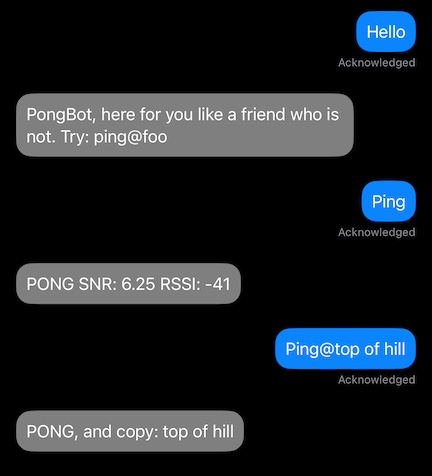

# meshing-around
Random Mesh Scripts for BBS activities for use with Meshtastic nodes

## pong-bot.sh


Little bot which will trap keywords like ping and respond on a DM with pong. The script will also monitor the group channels for keywords to trap on. you can also `Ping @Data to Echo` as a example for further processing.

other features
- MOTD with ability to set remotely
  - `motd` or `motd $New Message Of the day`

## mesh-bot.sh

 alternate bot, adds internet and other telemetry data which goes beyond just ping

- Various solar details
  - `sun` returns the sunrise and set for the day
  - `solar` gives an idea of the x-ray flux
  - `hfcond` returns a table of HF solar conditions

 ### Configurations
 Currently config modifications is edit to code. Be sure to uncomment the appropriate interface combo for your method (serial/BLEW/TCP). Only one at a time is supported to a single node at a time.
 ```
# Uncomment the interface you want to use depending on your device connection
interface = meshtastic.serial_interface.SerialInterface() #serial interface
#interface=meshtastic.tcp_interface.TCPInterface(hostname="192.168.0.1") # IP of your device
#interface=meshtastic.ble_interface.BLEInterface("AA:BB:CC:DD:EE:FF") # BLE interface
```
It is recomended to leave this setting as default `True` to keep the channel clear in larger mesh. 

```
RESPOND_BY_DM_ONLY = True # Set to True to respond messages via DM only (keeps the channel clean)
 ```
 Solar Data needs the LAT LONG for your area on the [solarconditions.py](solarconditions.py)
```
LATITUDE = 48.50
LONGITUDE = -123.0
```

# requirements
```
pip install meshtastic
pip install pubsub
```

meshbot enhancments

```
pip install suntime
pip install requests
pip install datetime
pip install python-dateutil
```

# Recognition
Used ideas and snippets from other responder bots want to call them out!
 - https://github.com/Murturtle/MeshLink
 - https://github.com/pdxlocations/Meshtastic-Python-Examples
