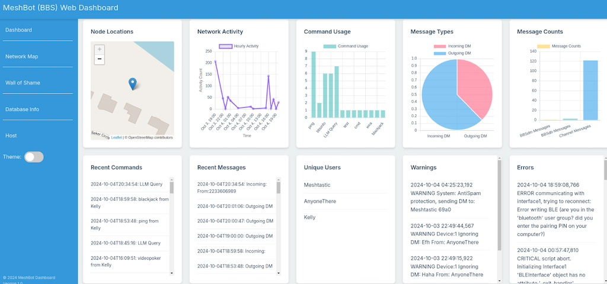

Logs will collect here.

Reporting is via [etc/report_generator5.py](../etc/report_generator5.p), run it from the etc/ working directory. The report_generator5 has newer feel and HTML5 coding. The index.html output is published in [../etc/www](../etc/www)
 - Make sure to have `SyslogToFile = True` and default of DEBUG log level to fully enable reporting! ‼️
 - provided serviceTimer templates in etc/



Logging messages to disk or 'Syslog' to disk uses the python native logging function.
```
[general]
# logging to file of the non Bot messages only
LogMessagesToFile = False
# Logging of system messages to file, needed for reporting engine
SyslogToFile = True
```

To change the stdout (what you see on the console) logging level (default is DEBUG) see the following example, line is in [/modules/log.py](/modules/log.py)

```
# Set level for stdout handler
stdout_handler.setLevel(logging.INFO)
```