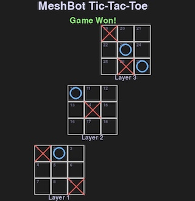

# Meshtastic Mesh-Bot Games

## Game Index

- [Blackjack](#blackjack-game-module)
- [DopeWars](#dopewars-game-module)
- [GolfSim](#golfsim-game-module)
- [Lemonade Stand](#lemonade-stand-game-module)
- [Tic-Tac-Toe (2D/3D)](#tic-tac-toe-game-module)
- [MasterMind](#mastermind-game-module)
- [Battleship](#battleship-game-module)
- [Football](#football-game-module)
- [Video Poker](#video-poker-game-module)
- [Hangman](#hangman-game-module)
- [Quiz](#quiz-game-module)
- [Survey](#survey--module-game)
- [Word of the Day Game](#word-of-the-day-game--rules--features)
- [Game Server](#game-server-configuration-gameini)
- [PyGame Help](#pygame-help)
---


# Blackjack Game Module

This module implements a classic game of Blackjack (Casino 21) for the Meshtastic mesh-bot.

## How to Play

- **Start the Game:**  
  Send the command `blackjack` via DM to the bot to start a new game session.
- **Place a Bet:**  
  When prompted, enter the amount you wish to wager (e.g., `5`). Minimum bet is 1 chip, maximum is your current chip total.
- **Gameplay Commands:**  
  After betting, you will be dealt two cards. The dealer will also have two cards (one face up).
  - `h` or `hit` — Draw another card.
  - `s` or `stand` — End your turn and let the dealer play.
  - `d` or `double` — Double your bet and draw one more card (if you have enough chips).
  - `f` or `forfit` — Forfeit half your bet and end the round.
  - `r` or `resend` — Resend your current hand status.
  - `l` or `leave` — Leave the table and end your session.

- **Winning:**  
  - Get as close to 21 as possible without going over.
  - If your hand exceeds 21, you bust and lose your bet.
  - If you beat the dealer without busting, you win your bet.
  - If you get a Blackjack (21 with two cards), you win 1.5x your bet.
  - If you tie the dealer, it's a push (no win/loss).

- **High Scores:**  
  The module tracks the highest chip total achieved. If you beat the high score, you'll be notified!

## Notes

- Each player starts with 100 chips.
- If you run out of chips, your balance will reset to 100.
- The game state is tracked per player using your node ID.
- Game progress and high scores are saved in `data/blackjack_hs.pkl`.
- Only one game session per player is supported at a time.
- For best results, play via DM to avoid interfering with other users' sessions.

## Example Session

```
You have 100 chips.   Whats your bet?
> 10

Player[14] 8♠️, 6♥️  
Dealer[10] 10♦️ 
🧠Hit: 38% 👎, 62% 👍
(H)it,(S)tand,(F)orfit,(D)ouble,(R)esend,(L)eave table
> h

Player[18] 8♠️, 6♥️, 4♣️  
Dealer[10] 10♦️ 
🧠Hit: 77% 👎, 23% 👍
[H,S,F,D]
> s

Player[18] 8♠️, 6♥️, 4♣️  
Dealer[20] 10♦️, Q♠️
👎DEALER WINS
📊🏆P:0,D:1,T:0
💰You have 90 chips 
Bet or Leave?
```

## Credits

- Ported from [Himan10/BlackJack](https://github.com/Himan10/BlackJack)
- Adapted for Meshtastic mesh-bot by K7MHI Kelly Keeton 2024

# DopeWars Game Module

A text-based trading game inspired by the classic DopeWars/DrugWars, adapted for the Meshtastic mesh-bot.

## How to Play

- **Start the Game:**  
  Send the command `dopewars` via DM to the bot to begin a new session.

- **Objective:**  
  Travel between cities, buy and sell drugs, and try to maximize your cash in 7 days.

- **Game Flow:**
  1. **Pick a Starting City:**  
     You’ll be shown a list of cities. Enter the number to choose your starting location.
  2. **Each Day:**  
     - You’ll see drug prices, your inventory, and your cash.
     - You can buy, sell, or fly to a new city.
     - Random events may occur (police, market changes, or finding cash/drugs).
  3. **Commands:**  
     - **Buy:** `b,drug#,qty#` (e.g., `b,1,10` buys 10 of drug 1)
     - **Sell:** `s,drug#,qty#` (e.g., `s,2,5` sells 5 of drug 2)
     - **Max:** Use `m` for max quantity (e.g., `b,1,m`)
     - **Sell All:** Just `s` to sell everything you have.
     - **Fly:** `f` to move to a new city (ends the day).
     - **Price List:** `p` to view current prices and inventory.
     - **End Game:** `e` to end your run early.
  4. **Repeat:**  
     Each time you fly, a day passes. After 7 days, your final cash is your score.

- **Winning:**  
  - Try to finish with as much cash as possible.
  - Beat the high score to be crowned the top dealer!

## Example Session

```
1. Red Deer  2. Edmonton  3. Calgary  4. Toronto  5. Vancouver  6. St. Johns  Where do you want to 🛫?#
> 2

🗺️Edmonton 📆1/7 🎒0/100 💵5,000
#1.Cocaine$15,000(0)    #2.Heroin$2,500(0)    #3.Weed$800(0)    ...
Buy💸, Sell💰, (F)ly🛫? (P)riceList?
> b,2,10

Heroin: you have🎒 0  The going price is: $2,500 
You bought 10 Heroin. Remaining cash: $47,500
Buy💸, Sell💰, Fly🛫?
> f

🗺️Toronto 📆2/7 🎒10/100 💵47,500
...
```

## Notes

- You start with $5,000 and a 100-slot backpack.
- Each drug has a random price per city and day.
- Special events can spike or crash prices, or cause you to lose/gain cash or inventory.
- Police may confiscate your drugs or cash.
- High scores are saved in `data/dopewar_hs.pkl`.
- Only one game session per player at a time.
- Play via DM for best experience.

## Credits

- Ported from [Reconfirefly/drugwars](https://github.com/Reconfirefly/drugwars)
- Adapted for Meshtastic mesh-bot by K7MHI Kelly Keeton 2024

# GolfSim Game Module

A text-based golf simulator for the Meshtastic mesh-bot. Play a full 9-hole round, choose your clubs, and try to set a new course record!

## How to Play

- **Start the Game:**  
  Send the command `golf` via DM to the bot to begin a new round.

- **Objective:**  
  Complete 9 holes in as few strokes as possible.

- **Game Flow:**
  1. **Each Hole:**  
     - The bot tells you the hole number, length, par, and any hazards or weather.
     - Choose your club for each shot by typing its name or initial:
       - `d` or `driver` — Longest club
       - `l` or `low` — Low iron
       - `m` or `mid` — Mid iron
       - `h` or `high` — High iron
       - `g` or `gap` — Gap wedge
       - `w` or `wedge` — Lob wedge
       - `c` or `caddy` — Get a caddy guess for club distances
     - The bot will tell you how far you hit and how far remains.
     - When you’re within 20 yards, you’ll automatically putt to finish the hole.
  2. **Scoring:**  
     - The bot tracks your strokes and score relative to par.
     - After each hole, you’ll see your score for the hole and your running total.
  3. **Hazards & Surprises:**  
     - Hazards (sand, water, trees, etc.) and random events may affect your shots.
     - Critters or weather can cause unexpected results!
  4. **End of Round:**  
     - After 9 holes, your total strokes and score to par are shown.
     - If you set a new low score, you’ll be notified as the new club record holder!

## Example Session

```
⛳️#1 is a 410-yard Par 4.☀️
Choose your club.
> d
🏌️Hit D 260yd. 
You have 150yd. ⛳️
Club?[D, L, M, H, G, W]🏌️
> m
🏌️Hit M Iron 170yd. Overshot the green!🚀
You have 20yd. ⛳️
Club?[D, L, M, H, G, W]🏌️
> w
🏌️Hit L Wedge 30yd. You're on the green! After 2 putt(s), you're in for 5 strokes. +Bogey 
You've hit a total of 5 strokes today, for +Bogey 
...
🎉Finished 9-hole round⛳️ 🏆New Club Record🏆
```

## Notes

- Play via DM for best experience.
- Hazards and weather are randomized for each hole.
- High scores are saved in `data/golfsim_hs.pkl`.
- Only one game session per player at a time.
- Commands are not case-sensitive; you can use full club names or initials.

## Credits

- Ported from [danfriedman30/pythongame](https://github.com/danfriedman30/pythongame)
- Adapted for Meshtastic mesh-bot by K7MHI Kelly Keeton 2024

# Lemonade Stand Game Module

A text-based business simulation where you run your own lemonade stand! Buy supplies, set prices, and try to maximize your profits over a summer season.

## How to Play

- **Start the Game:**  
  Send the command `lemonade` via DM to the bot to begin a new game.

- **Objective:**  
  Make as much money as possible in 7 weeks by managing your lemonade stand.

- **Game Flow:**
  1. **Each Week:**  
     - The bot will show you the weather, temperature, and sales potential.
     - Buy supplies: cups, lemons, and sugar. Enter the number of each to purchase, or `n` for none.
     - Set your selling price per cup.
     - The bot will simulate sales and show your results, profits, and remaining inventory.
     - Repeat for each week.
  2. **Commands:**  
     - Enter a number to buy supplies or set price.
     - Use `n` to skip buying an item.
     - Enter `g` during pricing to go back and buy more supplies.
     - At the end of each week, choose to continue or end the game.
  3. **Scoring:**  
     - Your score is based on your net profit and efficiency (profit vs. possible profit).
     - High scores are tracked and displayed at the end of the game.

## Example Session

```
LemonStand🍋Week #1 of 7. 85ºF Sunny ☀️
SupplyCost $0.45 a cup.
Sales Potential: 60 cups.
Inventory: 🥤:0 🍋:0 🍚:0
Prices:
🥤:$2.50 📦 of 25.
🍋:$4.00 🧺 of 8.
🍚:$3.00 bag for 15🥤.
💵:$30.00
🥤 to buy?
Have 0 Cost $2.50 a 📦 of 25
> 2

Purchased 2 📦 50 🥤  in inventory. $25.00 remaining
🍋 to buy?
Have 0🥤 of 🍋 Cost $4.00 a 🧺 for 8🥤
> 1

Purchased 1 🧺 8 🍋  in inventory. $21.00 remaining
🍚 to buy?
You have 0🥤 of 🍚, Cost $3.00 a bag for 15🥤
> 1

Purchased 1 bag(s) of 🍚 for $3.00. 15🥤🍚 in inventory.
Cost of goods is $0.45 per 🥤 $18.00 💵 remaining.
Price to Sell? or (G)rocery to buy more 🥤🍋🍚
> 1.25

Results Week📊#1 of 7 Cost/Price:$0.45/$1.25 P.Margin:$0.80 T.Sales:16@$1.25 G.Profit: $20.00 N.Profit:$12.80
Remaining 🥤:34 🍋:0 🍚:0 💵:$38.00📊P&L📈$8.00
Weekly📊#1.  16 sold x $1.25ea.
Play another week🥤? or (E)nd Game
```

## Notes

- You start with $30.00 and must buy supplies each week.
- Weather and temperature affect sales potential.
- If you run out of any supply, you can't sell more lemonade that week.
- High scores are saved in `data/lemonstand.pkl`.
- Only one game session per player at a time.
- Play via DM for best experience.

## Credits

- Ported from [tigerpointe/Lemonade-Stand](https://github.com/tigerpointe/Lemonade-Stand)
- Adapted for Meshtastic mesh-bot by K7MHI Kelly Keeton 2024

# Tic-Tac-Toe Game Module

A classic Tic-Tac-Toe game for the Meshtastic mesh-bot. Play against the bot, track your stats, and see if you can beat the AI!



## How to Play

- **Start the Game:**  
  Send the command `tictactoe` via DM to the bot to begin a new game.

- **3D Mode:**  
  You can play in 3D mode by sending `new 3d` during a game session. The board expands to 27 positions (1-27) and supports 3D win lines.

- **Run as a Game Server (Optional):**  
  For UDP/visual/remote play, you can run the dedicated game server:
  ```sh
  python3 script/game_serve.py
  ```
  This enables networked play and visual board updates if supported.
  [PyGame Help](#pygame-help)

- **Objective:**  
  Get three of your marks in a row (horizontally, vertically, or diagonally) before the bot does.

- **Game Flow:**
  1. **Board Layout:**  
     - The board is numbered 1-9 (2D) or 1-27 (3D), left to right, top to bottom.
     - Example (2D):
       ```
        1 | 2 | 3
        4 | 5 | 6
        7 | 8 | 9
       ```
  2. **Making Moves:**  
     - On your turn, type the number (1-9 or 1-27) where you want to place your mark.
     - The bot will respond with the updated board and make its move.
  3. **Commands:**  
     - `n` — Start a new game.
     - `new 2d` or `new 3d` — Start a new game in 2D or 3D mode.
     - `e` or `q` — End the current game.
     - `b` — Show the current board.
     - Enter a number (1-9 or 1-27) to make a move.
  4. **Winning:**  
     - The first to get three in a row wins.
     - If the board fills with no winner, it’s a tie.

## Example Session

```
❌ | 2 | 3
4 | ⭕️ | 6
7 | 8 | 9

Your turn! Pick 1-9:
> 3

❌ | 2 | ❌
4 | ⭕️ | 6
7 | 8 | 9

🤖Bot wins! (n)ew (e)nd
```

## Notes

- Emojis are used for X and O unless disabled in settings.
- Your win/loss stats are tracked across games.
- The bot will try to win, block you, or pick a random move.
- Play via DM for best experience, or run the game server for network/visual play.
- Only one game session per player at a time.

## Credits

- Written for Meshtastic mesh-bot by Martin, refactored by K7MHI

# MasterMind Game Module

A text-based version of the classic code-breaking game MasterMind for the Meshtastic mesh-bot. Try to guess the secret color code in as few turns as possible!

## How to Play

- **Start the Game:**  
  Send the command `mmind` via DM to the bot to begin a new game.

- **Objective:**  
  Guess the secret 4-color code in 10 turns or less.

- **Game Flow:**
  1. **Choose Difficulty:**  
     - (N)ormal: 4 colors (R🔴, Y🟡, G🟢, B🔵)
     - (H)ard: 6 colors (R🔴, Y🟡, G🟢, B🔵, O🟠, P🟣)
     - e(X)pert: 8 colors (R🔴, Y🟡, G🟢, B🔵, O🟠, P🟣, W⚪, K⚫)
     - Type `n`, `h`, or `x` to select.
  2. **Guessing:**  
     - Enter a 4-letter code using the color initials (e.g., `RGBY`).
     - The bot will respond with feedback:
       - ✅ color ✅ position: correct color in the correct spot
       - ✅ color 🚫 position: correct color, wrong spot
       - 🚫No pins: none of your colors are in the code
     - You have 10 turns to guess the code.
  3. **Winning:**  
     - Guess the code exactly to win!
     - Your number of turns is tracked for high scores.
     - After a win or loss, you can play again by choosing a difficulty.

## Example Session

```
The colors to choose from are:
R🔴, Y🟡, G🟢, B🔵
Enter your guess (e.g., RGBY):
> RGYB

Turn 1:
Guess🔴🟢🟡🔵
✅ color ✅ position: 2
✅ color 🚫 position: 1

> RYGB

Turn 2:
🏆Correct🔴🟡🟢🔵
You are the master mind!🤯
🏆 High Score:2 turns, Difficulty:n
Would you like to play again? (N)ormal, (H)ard, or e(X)pert?
```

## Notes

- Only one game session per player at a time.
- High scores are saved in `data/mmind_hs.pkl`.
- Play via DM for best experience.
- Input is not case-sensitive, but guesses must be exactly 4 letters.

## Credits

- Ported from [pwdkramer/pythonMastermind](https://github.com/pwdkramer/pythonMastermind)
- Adapted for Meshtastic mesh-bot by K7MHI Kelly Keeton 2024

# Video Poker Game Module

A text-based Video Poker game for the Meshtastic mesh-bot. Play classic five-card draw poker, place your bets, and try to build your bankroll!

## How to Play

- **Start the Game:**  
  Send the command `videopoker` via DM to the bot to begin a new session.

- **Objective:**  
  Win as many coins as possible by making the best poker hands.

- **Game Flow:**
  1. **Place Your Bet:**  
     - You start with 20 coins.
     - Enter your bet (1-5 coins) to begin each hand.
  2. **Draw Cards:**  
     - You are dealt 5 cards.
     - The bot will show your hand and a hint about its strength.
  3. **Redraw:**  
     - Choose which cards to replace:
       - Enter numbers (e.g., `1,3,4`) to redraw those cards.
       - Enter `a` to redraw all cards.
       - Enter `n` to keep your current hand.
       - Enter `h` to show your hand again.
     - You can only redraw once per hand.
  4. **Scoring:**  
     - After the redraw, your hand is scored and winnings are paid out based on the hand type.
     - If you run out of coins, your balance resets to 20.
     - High scores are tracked and announced.
  5. **Continue:**  
     - Place another bet to play again, or enter `l` to leave the table.

## Example Session

```
You have 20 coins, 
Whats your bet?
> 5

K♠️ 7♦️ 7♣️ 2♥️ 9♠️ 
Showing:Pair👯
Deal new card? 
ex: 1,3,4 or (N)o,(A)ll (H)and
> 1,4

7♦️ 7♣️ 9♠️ 3♣️ Q♥️ 
Your hand, Pair👯. Your bankroll is now 22 coins.
Place your Bet, or (L)eave Table.
```

## Hand Rankings & Payouts

- 👑Royal Flush🚽 — 10x bet
- 🧻Straight Flush🚽 — 9x bet
- Flush🚽 — 8x bet
- Full House🏠 — 7x bet
- Four of a Kind👯👯 — 6x bet
- Three of a Kind☘️ — 5x bet
- Two Pair👯👯 — 4x bet
- Straight📏 — 3x bet
- Pair👯 — 2x bet
- Bad Hand 🙈 — Lose bet

## Notes

- Only one game session per player at a time.
- High scores are saved in `data/videopoker_hs.pkl`.
- Play via DM for best experience.
- Bets must be between 1 and 5 coins and not exceed your bankroll.

## Credits

- Ported from [devtronvarma/Video-Poker-Terminal-Game](https://github.com/devtronvarma/Video-Poker-Terminal-Game)
- Adapted for Meshtastic mesh-bot by K7MHI Kelly Keeton 2024


# Battleship Game Module

A classic Battleship game for the Meshtastic mesh-bot. Play solo against the AI or challenge another user in peer-to-peer (P2P) mode!

## How to Play

- **Start a New Game (vs AI):**  
  Send `battleship` via DM to the bot to start a new game against the AI.

- **Start a New P2P Game:**  
  Send `battleship new` to create a game and receive a join code.  
  Share the code with another user.

- **Join a P2P Game:**  
  Send `battleship join <code>` (replace `<code>` with the provided number) to join a waiting game.

- **View Open Games:**  
  Send `battleship lobby` to see a list of open P2P games waiting for players.

- **Gameplay:**  
  - Enter your move using coordinates:  
    - Format: `B4` or `B,4` (row letter, column number)
    - Example: `C7`
  - The bot will show your radar, ship status, and results after each move.
  - In P2P, you and your opponent take turns. The bot will notify you when it’s your turn.

- **End Game:**  
  Send `end` or `exit` to leave your current game.

## Rules & Features

- 10x10 grid, classic ship sizes (Carrier, Battleship, Cruiser, Submarine, Destroyer).
- Ships are placed randomly.
- In P2P, the joining player goes first.
- Radar view shows a 4x4 grid centered on your last move.
- Game tracks whose turn it is and notifies the next player in P2P mode.
- Game ends when all ships of one player are sunk.

## Example Session

```
New 🚢Battleship🤖 game started!
Enter your move using coordinates: row-letter, column-number.
Example: B5 or C,7
Type 'exit' or 'end' to quit the game.

> B4

Your move: 💥Hit!
AI ships: 5/5 afloat
Radar:
🗺️3 4 5 6
B ~ ~ * ~
C ~ ~ ~ ~
D ~ ~ ~ ~
E ~ ~ ~ ~
AI move: D7 (missed)
Your ships: 5/5 afloat
```

## Notes

- Only one Battleship session per player at a time.
- Play via DM for best experience.
- In P2P, share the join code with your opponent.
- Coordinates are not case-sensitive.

## Credits

- Written for Meshtastic mesh-bot by K7MHI Kelly Keeton 2025

# Football Game Module

A classic N.F.U. Football game adapted for Meshtastic mesh-bot. Play against the bot (or another human in the future) using natural language commands!

## How to Play

- **Start a New Game:**  
  Send `football` or `fb` via DM to the bot to start a new game.

- **Gameplay:**  
  You always play Team 1 (offense), starting on your own 20-yard line.  
  The bot plays Team 2 (defense).
  
  **Offensive Plays (Natural Language):**
  - `run` — Running plays (gains 0-20 yards)
  - `pass` — Passing plays (gains 5-30 yards, high variance)
  - `bomb` — Bomb pass (high risk, high reward)
  - `sweep` — Sweep around the edge
  - `option` — Option play (run or pass)
  - `screen` — Screen pass (short, safe)

  **Special Plays (4th Down Only):**
  - `punt` — Punt the ball away
  - `field goal` or `fg` — Attempt a field goal

  **Game Commands:**
  - `score` or `s` — Show current score and field
  - `help` or `?` — Show available plays and tips
  - `new` or `n` — Start a new game
  - `end` or `exit` — End the current game

- **Game Objective:**  
  Score points by moving the ball toward the opponent's endzone and reach the winning score (default: 20 points).

- **Scoring:**  
  - **Touchdown:** 6 points (ball reaches opponent's endzone)
  - **Extra Point:** 1 point (automatic conversion, 90% success rate)
  - **Field Goal:** 3 points (attempt on any down)
  - **Safety:** 2 points (awarded to defending team)

- **Game Flow:**  
  - Each drive consists of 4 downs to gain 10 yards (1st down).
  - Turnover on downs if you don't gain 10 yards in 4 plays.
  - Possession changes after touchdowns, safeties, turnovers, or punts.
  - Game ends when either team reaches the winning score.

## Bot Strategy

The bot uses a **biased random strategy**:
- 70% random play selection
- 20% counter-play (if you run repeatedly, bot defends against passes)
- 10% aggressive defensive plays

This makes the bot both unpredictable and challenging!

## Example Session

```
🏈 **FOOTBALL** 🏈
User vs Bot · Win at 20 pts

**Coin Flip**: Team 2 receives kickoff

🏟️  **FIELD**
[0   10   20   30   40   50   60   70   80   90   100]
●
Down: 1/4 | Yard Line: 20

**Commands**: run, pass, sweep, bomb, punt, field goal
Or type: score, help, end

**🤖 Bot's Turn (Team 2)** 🤖

**Bot Play**: LEFT SWEEP
**Yards Gained**: 8

📍 **Bot First Down!**

🏟️  **FIELD**
[0   10   20   30   40   50   60   70   80   90   100]
    ●
Down: 1/4 | Yard Line: 28

Your play: run, pass, sweep, bomb, punt, field goal?
> pass

**User (Team 1)**: SCREEN PASS
**Bot Defense**: QB SNEAK
**Yards Gained**: 12

🏈 **TOUCHDOWN!** 🏈
Extra point **GOOD**. 7 points!

📊 **SCORE**
User (Team 1): 7
Bot  (Team 2): 8

🏟️  **FIELD**
[0   10   20   30   40   50   60   70   80   90   100]
                  ●
Down: 1/4 | Yard Line: 80

Your play: run, pass, sweep, bomb, punt, field goal?
> help

🏈 **FOOTBALL HELP** 🏈

**Offensive Plays:**
  run       - Running plays (gains 0-20 yards)
  pass      - Passing plays (gains 5-30 yards, high variance)
  bomb      - Bomb pass (high risk/high reward)
  sweep     - Sweep around the edge
  option    - Option play (run or pass)
  screen    - Screen pass (short, safe)

**Special Plays (4th Down Only):**
  punt      - Punt the ball away
  fg / field goal - Attempt a field goal

**Commands:**
  score   - Show current score
  help    - This help text
  new     - Start a new game
  end     - End the current game
```

## Rules & Features

- 100-yard field (0–100 yard line)
- Classic football rules: 4 downs to gain 10 yards
- Touchdown endzone at opponent's 100-yard line
- Turnover on downs if 10 yards not gained
- 2.5% chance of fumble per play (loses possession)
- Safeties occur if ball pushed back past own endzone
- Game state stored per player (nodeID)
- Supports concurrent games from multiple users

## Notes

- Each player starts at their own 20-yard line after scoring
- Initial possession determined by coin flip
- Only one game session per player at a time
- Play via DM to avoid interfering with other users
- Natural language input allows flexible phrasing (e.g., "run", "rushing", "carry" all work)
- Game data is stored in-memory; restarting the bot resets all games

## Future Enhancements

- Two-player mode (user vs. user) similar to Battleship
- Play statistics and leaderboards
- Playbook customization
- Multi-message game display for visual improvements
- Field position tracking across possessions

## Credits

- Ported from the classic BASIC N.F.U. Football game
- Original Python port by Martin Thoma (2022)
- Original JavaScript version by Oscar Toledo G. (nanochess)
- Refactored for Meshtastic mesh-bot by K7MHI Kelly Keeton 2025

# Word of the Day Game — Rules & Features

- **Word of the Day:**  
  Each day, a new word is chosen from `data/wotd.json` (or a default list if missing). Mention the word (or its leet/1337 variants) in chat to win and trigger a new word.
- **Bingo Mini-Game:**  
  A random 3x3 bingo card of words, drawn from `data/bingo.json` (or a default list if missing). Mention words from the card in chat. Complete a row, column, or diagonal to win BINGO and get a new card.
- **Emoji Mini-Game:**  
  Use emojis in chat to:
  - Play a slot machine: send the same emoji several times in a row to hit the JACKPOT!
- **Data Files:**
  - `data/wotd.json`: List of words and definitions for the Word of the Day.
[
  {
    "word": "serendipity",
    "meta": "The occurrence of events by chance in a happy or beneficial way."
  },
  {
    "word": "ephemeral",
    "meta": "Lasting for a very short time."
  },
  {
    "word": "sonder",
    "meta": "The realization that each passerby has a life as vivid and complex as your own."
  }
]
  - `data/bingo.json`: List of words for bingo cards.  
[
  "dog",
  "cat",
  "fish",
  "bird",
  "hamster",
  "rabbit",
  "turtle",
  "lizard",
  "snake"
]

# Hangman Game Module

A classic word-guessing game for the Meshtastic mesh-bot. Try to guess the hidden word one letter at a time before you run out of chances!

## How to Play

- **Start the Game:**  
  Send the command `hangman` via DM to the bot to begin a new game.

- **Objective:**  
  Guess the secret word by suggesting letters, one at a time. Each incorrect guess brings you closer to losing!

- **Game Flow:**
  1. **New Game:**  
     - The bot picks a random word and shows you its masked form (e.g., `_ _ _ _ _`).
     - You’ll see your total games played and games won.
  2. **Guessing:**  
     - Type a single letter to guess.
     - Correct guesses reveal all instances of that letter in the word.
     - Incorrect guesses are tracked; you have 6 chances before the game ends.
     - The bot shows your progress, wrong guesses, and a hangman emoji status.
  3. **Winning & Losing:**  
     - Guess all letters before reaching 6 wrong guesses to win!
     - If you lose, the bot reveals the word and starts a new game.

- **Commands:**  
  - Enter a single letter to guess.
  - Start a new game by sending `hangman` again.

## Example Session

```
_ _ _ _ _ _ _ 
Guess a letter


🥳
Total Games: 1, Won: 1
M E S H T A S T I C
Guess a letter
```

## Notes

- The word list is loaded from `data/hangman.json` if available, or uses a built-in default list. [\"apple\",\"banana\",\"cherry\"]
- Game stats are tracked per player.
- Only one game session per player at a time.
- Play via DM for best experience.

## Data Files

- `data/hangman.json`: List of words for Hangman.  
  Example:
  ```
  [
    "apple",
    "banana",
    "cherry"
  ]
  ```

## Credits

- Written for Meshtastic mesh-bot by ZR1RF Johannes le Roux 2025

# Quiz Game Module

This module implements a multiplayer quiz game for the Meshtastic mesh-bot.

## How to Play

- **Start the Game:**  
  The quizmaster starts the quiz session (usually with `/quiz start` or similar command).
- **Join the Game:**  
  Players join by sending `/quiz join` or by answering a question while a quiz is active.
- **Answer Questions:**  
  - Use `Q: <answer>` to answer the current question.  
    - For multiple choice, answer with `A`, `B`, `C`, etc.
    - For free-text, type the answer after `Q: `.
  - Use `Q: ?` to request the next question.
- **Leave the Game:**  
  Players can leave at any time with `/quiz leave`.
- **Stop the Game:**  
  The quizmaster stops the quiz session (e.g., `/quiz stop`). Final scores and the top 3 players are announced.

## Rules & Features

- Only the quizmaster can start or stop the quiz.
- Players can join or leave at any time while the quiz is active.
- Questions are loaded from quiz_questions.json and can be multiple choice or free-text.
- Players earn 1 point for each correct answer.
- The first player to answer each question correctly is noted.
- The top 3 players are displayed at the end of the quiz.
- The quizmaster can broadcast messages to all players.

## Example Commands

- Start quiz:  
  `/quiz start`
- Join quiz:  
  `/quiz join`
- Answer a question:  
  `Q: B`  
  `Q: Paris`
- Next question:  
  `Q: ?`
- Leave quiz:  
  `/quiz leave`
- Stop quiz:  
  `/quiz stop`

## Notes

- Only one quiz can be active at a time.
- Players can only answer each question once.
- The quizmaster is defined by the `bbs_admin_list` variable.
- Questions must be formatted correctly in the JSON file for the game to function.

---

**Written for Meshtastic mesh-bot by K7MHI Kelly Keeton 2025**

Certainly! Here’s documentation for the **Survey Game Module** in the same format as your other game modules:

---

# Survey  Module "game"
This module implements a survey system for the Meshtastic mesh-bot.

## How to Play

- **Start the Survey:**  
  Users start a survey by specifying the survey name (e.g., `/survey start example`).  
  The survey will prompt the user with the first question.

- **Answer Questions:**  
  - For multiple choice: reply with a letter (A, B, C, ...).
  - For integer: reply with a number.
  - For text: reply with your answer as text.
  After each answer, the next question is shown automatically.

- **End the Survey:**  
  The survey ends automatically after the last question, or the user can send `end` to finish early.  
  Responses are saved to a CSV file.

## Rules & Features

- Surveys are defined in JSON files in surveys (e.g., `example_survey.json`).
- Each survey can have multiple choice, integer, or text questions.
- User responses are saved to a CSV file named `<survey_name>_responses.csv` in the same directory.
- Users can only answer each question once per survey session.
- Survey results can be summarized and reported by the bot.

## Example Commands

- Start a survey:  
  `/survey start example`
- Answer a multiple choice question:  
  `A`
- Answer an integer question:  
  `42`
- Answer a text question:  
  `My favorite color is blue.`
- End the survey early:  
  `end`
- Get survey results (admin):  
  `/survey results example`

## Notes

- Only surveys listed in the surveys directory with the `_survey.json` suffix are available.
- Each user’s responses are tracked separately.
- Results are summarized and can be displayed by the bot.

---

**Written for Meshtastic mesh-bot by K7MHI Kelly Keeton 2025**

___

# Game Server Configuration (`game.ini`)

The game server (`script/game_serve.py`) supports configuration via a `game.ini` file placed in the same directory as the script. This allows you to customize network and node settings without modifying the Python code.

## How to Use

1. **Create a `game.ini` file** in the `script/` directory (next to `game_serve.py`).

If `game.ini` is not present, the server will use built-in default values.

---


# PyGame Help

'pygame - Community Edition' ('pygame-ce' for short) is a fork of the original 'pygame' library by former 'pygame' core contributors.

It offers many new features and optimizations, receives much better maintenance and runs under a better governance model, while being highly compatible with code written for upstream pygame (`import pygame` still works).

**Details**
- [Initial announcement on Reddit](<https://www.reddit.com/r/pygame/comments/1112q10/pygame_community_edition_announcement/>) (or https://discord.com/channels/772505616680878080/772506385304649738/1074593440148500540)
- [Why the forking happened](<https://www.reddit.com/r/pygame/comments/18xy7nf/what_was_the_disagreement_that_led_to_pygamece/>)

**Helpful Links**
- https://discord.com/channels/772505616680878080/772506385304649738
- [Our GitHub releases](<https://github.com/pygame-community/pygame-ce/releases>)
- [Our docs](https://pyga.me/docs/)

**Installation**
```sh
pip uninstall pygame # Uninstall pygame first since it would conflict with pygame-ce
pip install pygame-ce
```
-# Because 'pygame' installs to the same location as 'pygame-ce', it must first be uninstalled.
-# Note that the `import pygame` syntax has not changed with pygame-ce.

# mUDP Help

mUDP library provides UDP-based broadcasting of Meshtastic-compatible packets. MeshBot uses this for the game_server_display server.

**Details**
- [pdxlocations/mudp](https://github.com/pdxlocations/mudp)

**Installation**
```sh
pip install mudp
```